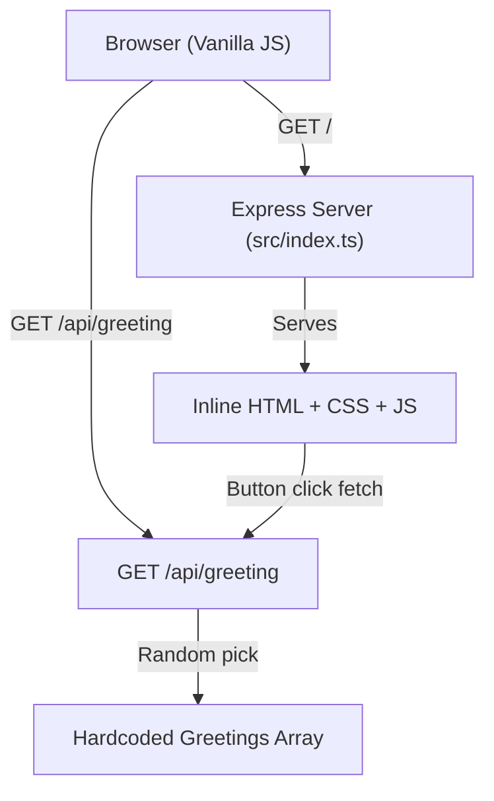

# Architecture

## System Design

Single-process Node.js/Express server serving both HTML and API endpoints. No external dependencies (no database, no cache, no message queue).

## Component Diagram

## Data Flow

1. **Page Load**: Browser requests `GET /` -> Express renders inline HTML with server time -> Browser displays page
2. **Greeting Fetch**: User clicks button -> Client JS calls `GET /api/greeting` -> Server picks random greeting from hardcoded array -> Returns JSON `{ greeting: string }` -> Client JS updates DOM

## Key Decisions

- **Single file**: All server logic in `src/index.ts` for simplicity
- **Inline HTML**: No template engine; HTML string in route handler
- **No live updates**: Server time rendered once at page load
- **Self-contained**: No external services or databases
