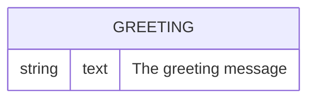

# Data Model

## Overview

No persistent data store. All data is in-memory and hardcoded.

## Entities

### Greeting
A string value from a hardcoded array.



## Data Structures

### Greetings Array
- Type: `string[]`
- Location: `src/index.ts` (module-level constant)
- Content: Hardcoded list of greeting strings
- Access: Random selection via `Math.random()`

### API Response: GreetingResponse
```typescript
interface GreetingResponse {
  greeting: string;
}
```

## Relationships

No relationships; single flat data structure.
